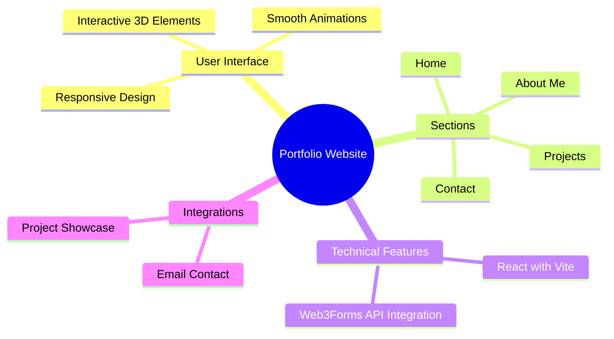

# Professional Multi-Page Portfolio

Welcome to my personal portfolio website! This is a modern, responsive, and multi-page portfolio designed for showcasing my journey as a Computer Science student and a Full-Stack Web Developer.

---

## About Me

- **Name:** Joyanta Banerjee
- **College:** Kalyani Government Engineering College (KGEC)
- **Specialization:** Full-Stack Development (Laravel & React)
- **Current Role:** Web Developer Intern at IEEE CIS & Arodek

---

## Features

- **Multi-Page Architecture:** Dedicated pages for Home, About, Projects, and Contact.
- **Dark/Light Mode Toggle:** A smooth sliding switch with useContext.
- **AOS Animations:** Engaging scroll-based animations for a premium feel.
- **Workable Contact Form:** Integrated with Web3Forms (No PHP required for the front-end).
- **Responsive Design:** Fully optimized for Mobile, Tablet, and Desktop views.
- **Interactive Progress Bars:** Showcasing technical proficiency in Laravel, React, and more.
- **Project Case Studies:** Detailed breakdown of core projects.

---

## Project Mindmap



---

## Tech Stack

- **Frontend:** React 19, Vite, CSS3 (Custom Variables, Grid, Flexbox), JavaScript
- **Routing:** React Router DOM
- **Animations:** AOS (Animate On Scroll) Library
- **Icons:** SVG Icons
- **Forms:** Web3Forms API
- **Fonts:** Google Fonts (Poppins)
- **Deployment:** GitHub Pages

---

## File Structure

```text
├── public/
│   └── man-technologyst.png
├── src/
│   ├── assets/
│   │   └── Profile.jpeg
│   ├── components/
│   │   ├── Card.jsx
│   │   ├── Education.jsx
│   │   ├── Experience.jsx
│   │   ├── Footer.jsx
│   │   ├── Navbar.jsx
│   │   ├── ProjectsContent.jsx
│   │   ├── ProjectsHeader.jsx
│   │   ├── ProjectsSidebar.jsx
│   │   ├── Sidebar.jsx
│   │   ├── SkillBox.jsx
│   ├── context/
│   │   └── ThemeContext.jsx
│   ├── pages/
│   │   ├── About.jsx
│   │   ├── Contact.jsx
│   │   ├── Home.jsx
│   │   ├── Projects.jsx
│   │   └── Projects/
│   │       ├── AllProjects.jsx
│   │       ├── CoachingApp.jsx
│   │       ├── ExamSystem.jsx
│   │       ├── ForestFire.jsx
│   │       └── GreenBird.jsx
│   ├── App.css
│   ├── App.jsx
│   └── main.jsx
├── index.html
├── package.json
├── vite.config.js
└── README.md
```

---

## Installation & Setup

1. **Clone the repository:**
   ```bash
   git clone https://github.com/Joya-nta/My-Portfolio
   cd portfolio
   ```

2. **Install dependencies:**
   ```bash
   npm install
   ```

3. **Personalize the details:**

- Update your name, bio, CV Link, and project links in the relevant React components (e.g., `src/pages/Home.jsx`, `src/pages/About.jsx`).

- Update your Web3Forms Access Key in `src/pages/Contact.jsx`.

- Replace the profile picture in `src/assets/`.

4. **Run the development server:**
   ```bash
   npm run dev
   ```

5. **Build for production:**
   ```bash
   npm run build
   ```

6. **Deploy to GitHub Pages:**
   ```bash
   npm run deploy
   ```
---


## Contact Me

- Email: tr905706@gmail.com

- LinkedIn: [Click here](https://linkedin.com/in/joyanta-banerjee-a48a95294)

- Website: [Click here](https://github.com/Joya-nta)
